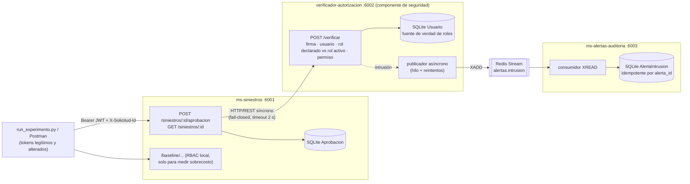

# Experimento 2 — Detección de elevación de privilegios (Módulo 7, Seguridad)

**Título:** Detección de Elevación de Privilegios mediante Validación Contextual e Inmutabilidad de Roles en Solventa.

**Propósito:** validar que un componente propio de la arquitectura (el **Verificador Central de Autorización**) detecta una elevación de privilegios **ya materializada**. El caso es un usuario interno con rol restringido (*AtencionCliente*) que evade la autorización de borde e invoca operaciones reservadas al *LiquidadorSiniestros*. Ante eso, el verificador debe emitir una alerta de intrusión en tiempo real.

| | |
|---|---|
| **Historia de arquitectura** | ASR-SEG-09: Integridad y confidencialidad ante elevación de privilegios internos |
| **Punto de sensibilidad** | La capacidad de la arquitectura para identificar inconsistencias de permisos en el core cuando las políticas RBAC locales o de borde fueron evadidas |
| **Estilo** | Microservicios con un punto de control interno centralizado |
| **Tácticas** | Verificación contextual de inconsistencias · Notificación/registro de intrusión · Punto único de control (efecto embudo) |
| **Nivel de incertidumbre** | Medio-Alto |

### Resultados esperados (hipótesis)

| Métrica | Meta |
|---|---|
| Detección de ataques (alerta registrada por `solicitud_id`) | **100 %** |
| Falsos positivos sobre usuarios legítimos | **0 %** |
| Aprobaciones ejecutadas por solicitudes de ataque (integridad) | **0** |
| Sobrecosto de latencia del salto al verificador (p95) | **< 50 ms** |

## Arquitectura



### Componentes y conectores

| Componente | Propósito | Tecnología |
|---|---|---|
| `ms-siniestros` | Expone la aprobación de indemnizaciones y delega la validación de rol al verificador. Si el verificador no responde, **niega** (fail-closed) | Python 3.11 + Flask |
| `verificador-autorizacion` | Consulta el rol formal del usuario en la fuente de verdad y detecta inconsistencias con el contexto de la petición | Python 3.11 + Flask + PyJWT |
| `ms-alertas-auditoria` | Consume la señal de anomalía y registra la alerta de intrusión | Python 3.11 + Flask |
| HTTP/REST inter-servicio | Consulta síncrona antes de ejecutar la transacción | `requests` (keep-alive) |
| Mensajería asíncrona | Publicación de la alerta hacia el bus de auditoría | Redis Streams |

### Reglas del verificador

El verificador valida en este orden, y cada falla que se marca como intrusión genera una alerta:

| # | Chequeo | Motivo si falla | ¿Intrusión? |
|---|---|---|---|
| 1 | Firma HS256 válida (rechaza `alg=none`, claves ajenas, payload editado) | `TOKEN_ALTERADO` | Sí |
| 1b | Token vigente | `TOKEN_EXPIRADO` | No |
| 2 | El usuario (`sub`) existe y está activo en la fuente de verdad | `USUARIO_DESCONOCIDO` | Sí |
| 3 | El rol declarado en el token coincide con el **rol activo** | `ROL_INCONSISTENTE` | Sí |
| 4 | El rol activo tiene permiso para la operación | `PRIVILEGIO_INSUFICIENTE` | Sí (el borde fue evadido) |

La regla 3 aplica la **inmutabilidad de roles**: el token no decide nada por sí solo. Si a un usuario se le revoca el rol (`PUT /usuarios/<u>`), los tokens que ya tenía dejan de servir de inmediato.

### Escenarios del experimento

Usuarios semilla: `ana.atencion`, `jorge.atencion`, `pedro.degradado` (AtencionCliente; a pedro se le revocó el rol de liquidador), `luis.liquidador` y `carla.liquidadora` (LiquidadorSiniestros).

| Tipo | Clase | Descripción | Motivo esperado |
|---|---|---|---|
| `firma_alterada` | ataque | Token de ana con el claim `rol` editado a Liquidador, conservando la firma original | TOKEN_ALTERADO |
| `firma_otra_clave` | ataque | Token firmado con una clave que no es la del borde | TOKEN_ALTERADO |
| `alg_none` | ataque | Token sin firma (`alg=none`) | TOKEN_ALTERADO |
| `rol_inyectado` | ataque | Token **bien firmado** de jorge que declara Liquidador (borde comprometido) | ROL_INCONSISTENTE |
| `rol_revocado` | ataque | Token viejo de pedro que aún declara Liquidador | ROL_INCONSISTENTE |
| `evasion_borde` | ataque | Token legítimo de ana (AtencionCliente) que llega directo a la aprobación | PRIVILEGIO_INSUFICIENTE |
| `usuario_fantasma` | ataque | Token firmado para un usuario que no existe | USUARIO_DESCONOCIDO |
| `liquidador_aprueba` / `liquidadora_aprueba` | legítima | Aprobaciones de liquidadores reales | 201, sin alerta |
| `atencion_consulta` / `degradado_consulta` | legítima | Consultas de atención al cliente | 200, sin alerta |

Las solicitudes se mezclan al azar con una semilla fija, así que la corrida es reproducible. Cada una lleva un `X-Solicitud-Id`, y al terminar se audita contra `/alertas` y `/aprobaciones`.

## Ejecución

Requisito: Docker + Docker Compose v2.

```bash
cd experimento-2-seguridad
docker compose up -d --build
```

Abre el **dashboard en http://localhost:8081**.

### Dashboard

Todo lo que muestra el dashboard sale del estado real de los servicios; no hay contadores simulados. Tiene tres pestañas:

- **Experimento**
  - Diagrama del flujo Clientes → Siniestros → Verificador → Bus Redis → Auditoría. Cada solicitud se anima como un paquete: verde si es legítima, rojo si es un ataque, y amarillo para la alerta que viaja al bus.
  - **Experimento automático**: configuras cuántas legítimas, ataques y pares de latencia quieres, y la pausa entre solicitudes para que el flujo se alcance a ver. Muestra el avance por fases.
  - **Disparo manual**: lanza un ataque específico, los 7 de una vez, o una solicitud legítima, y muestra cómo la trató el verificador.
  - **Disponibilidad**: apaga o prende el contenedor del verificador para demostrar el *fail-closed* (503).
  - **Fuente de verdad**: edita el rol o el estado activo de cada usuario para demostrar la inmutabilidad de roles.
  - KPIs en vivo y la tabla de solicitudes.
- **Centro de alertas**: KPIs de alertas, gráfico de alertas por motivo, usuarios con más alertas, alertas en el tiempo apiladas por motivo, y el registro de intrusiones con filtro por motivo y búsqueda.
- **Resultados**
  - Veredicto de la hipótesis y una tarjeta por criterio contra su meta.
  - Detección por escenario.
  - Histogramas de latencia (RBAC local vs. verificador central).
  - Alertas de la corrida por motivo.
  - Historial de corridas y descarga del reporte en JSON.

El dashboard monta `/var/run/docker.sock` para apagar y prender el verificador. Si no tiene acceso, muestra los comandos `docker stop/start verificador-autorizacion` para correrlos a mano.

### Script de línea de comandos (alternativa sin dashboard)

```bash
pip install -r requirements-dev.txt
python experimento/run_experimento.py            # --legitimas 60 --ataques 70 --latencia 100
```

El script imprime la tabla por tipo, las métricas y el veredicto por criterio, y guarda el JSON en `resultados/`. Termina con código 0 si la hipótesis se confirma y 1 si no. El dashboard usa exactamente la misma función (`ejecutar`).

### Pruebas manuales (curl / Postman)

```bash
# Token legítimo de liquidador (el secreto por defecto está en docker-compose.yml)
TOKEN=$(python -c "import sys; sys.path.insert(0,'experimento'); from tokens import emitir; print(emitir('luis.liquidador','LiquidadorSiniestros','solventa-secreto-dev-no-usar-en-produccion'))")
curl -X POST http://localhost:6001/siniestros/SIN-1/aprobacion -H "Authorization: Bearer $TOKEN"

# Evasión de borde: atención al cliente intenta aprobar -> 403 + alerta
TOKEN=$(python -c "import sys; sys.path.insert(0,'experimento'); from tokens import emitir; print(emitir('ana.atencion','AtencionCliente','solventa-secreto-dev-no-usar-en-produccion'))")
curl -X POST http://localhost:6001/siniestros/SIN-2/aprobacion -H "Authorization: Bearer $TOKEN"

curl http://localhost:6003/alertas                 # alertas registradas
curl http://localhost:6002/stats                   # contadores del verificador
curl -X PUT http://localhost:6002/usuarios/luis.liquidador -H "Content-Type: application/json" -d '{"rol":"AtencionCliente"}'  # revocar rol
```

### Endpoints

| Servicio | Endpoint | Descripción |
|---|---|---|
| ms-siniestros | `POST /siniestros/<id>/aprobacion` | Operación sensible (`siniestro:aprobar`) |
| ms-siniestros | `GET /siniestros/<id>` | Consulta (`siniestro:consultar`) |
| ms-siniestros | `POST /baseline/siniestros/<id>/aprobacion` | Igual, pero con RBAC local sobre el token (solo si `HABILITAR_BASELINE=true`) |
| ms-siniestros | `GET /aprobaciones` | Auditoría de integridad: `total`, `por_usuario`, `solicitud_ids` |
| verificador-autorizacion | `POST /verificar` | `{token, operacion, solicitud_id, recurso}` → decisión |
| verificador-autorizacion | `GET /usuarios` · `PUT /usuarios/<u>` | Fuente de verdad de roles |
| verificador-autorizacion | `GET /stats` | Verificaciones, intrusiones, alertas publicadas y pendientes |
| ms-alertas-auditoria | `GET /alertas` | Total, por motivo, latencia detección→registro y detalle |
| todos | `POST /reset` · `GET /health` | Reinicio de datos · healthcheck |
| dashboard (:8081) | `GET /api/estado` · `/api/eventos` · `/api/alertas` | Estado agregado, feed de solicitudes, alertas |
| dashboard (:8081) | `POST /api/experimento/iniciar` · `GET /api/experimento/estado` | Orquesta una corrida y reporta su avance |
| dashboard (:8081) | `POST /api/solicitud` · `POST /api/verificador/stop\|start` | Disparo manual · control del contenedor |

## Pruebas

```bash
pip install -r requirements-dev.txt
pytest                   # unitarias + experimento completo en proceso (sin Docker ni Redis)
pytest -m integration    # experimento real contra los contenedores (docker compose up -d)
```

## Trade-offs observables

- **Desempeño:** cada solicitud sensible paga un salto síncrono adicional. El script lo mide contra la ruta `/baseline` (RBAC local).
- **Disponibilidad:** el verificador es un punto crítico. Con `docker stop verificador-autorizacion`, Siniestros responde **503** y no ejecuta nada (fail-closed).
- **Bus de auditoría:** la alerta se publica fuera del camino de la petición. Si Redis cae, las alertas quedan encoladas en el verificador y se publican al volver (`alertas_pendientes` en `/stats`).

## Distribución de actividades

| Integrante | Tareas | Esfuerzo |
|---|---|---|
| Juan Miguel López | Prototipos Flask de Siniestros y del Verificador Central | 8 h |
| Santiago Perez Castañeda | Scripts pytest que simulan la elevación de permisos y las pruebas con usuarios legítimos | 6 h |
| Santiago Serrano | Medición de detección (100 %), falsos positivos (0 %) y sobrecosto de latencia (< 50 ms) | 6 h |
| Integrante 4 | Documentación, informe de resultados y análisis contra la hipótesis | 4 h |
